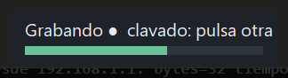
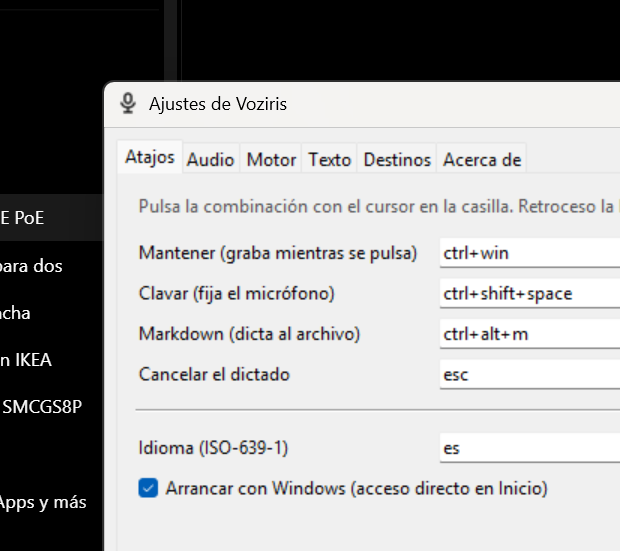

# Voziris

Dictado por voz para Windows. Mantienes un atajo, hablas, sueltas, y el texto
aparece donde tengas el cursor.

Dos motores a elegir: **local**, gratis y sin conexión, que funciona en
portátiles sin GPU; o **por API**, con tu propia clave, por unos céntimos al
mes. Sin cuentas, sin servidor propio, sin suscripción.



## Por qué existe

Wispr Flow cuesta 144 $/año, procesa todo en la nube —no tiene modo local en
ningún plan— y su ajuste de tono y estilo solo funciona en inglés. Voziris
cubre esos tres huecos. Con Groq, transcribir media hora de audio al día sale
por unos 0,60 $ al mes; en local, por cero.

## Qué hace

| | |
|---|---|
| **Cuatro atajos** | `Ctrl+Win` graba mientras lo mantienes, `Ctrl+Shift+Espacio` deja el micrófono clavado hasta que vuelves a pulsar o te callas, `Ctrl+Alt+M` manda el dictado a un archivo Markdown mientras lo mantienes y `Ctrl+Shift+M` lo hace con el micrófono clavado. El corte al callar se puede apagar desde la bandeja («Cortar al callar») |
| **Puntuación de serie** | El modelo emite puntuación y mayúsculas en español, también sin conexión |
| **Limpia lo que dices** | Quita muletillas y resuelve tus autocorrecciones al hablar («el martes, no, el jueves»), con un LLM opcional |
| **No te toca el portapapeles** | Lo guarda antes de escribir y lo devuelve después |
| **Historial con reintento** | Si el pegado falla, el texto no se pierde: se reentrega desde el menú de la bandeja |
| **Diccionario propio** | Para los nombres propios y la jerga que el modelo falla siempre |
| **Portable** | Se copia y funciona. Sin instalador, sin registro, sin permisos de administrador |

## Primer arranque

1. Descarga el ZIP de la última [release](https://github.com/alfonsosanzme/voziris/releases)
   y descomprímelo donde quieras (un USB vale). Son unos 1 100 archivos:
   espera a que la extracción termine del todo antes de ejecutar nada. Si
   `voziris.exe` se lanza a medias, falla con «No module named
   numpy._core…» y basta con esperar y volver a abrirlo.
2. Comprueba el hash SHA-256 que viene en las notas de la release si tu
   antivirus protesta (ver «Limitaciones conocidas»).
3. Ejecuta `voziris.exe`. Aparece el icono del micrófono en la bandeja y
   **empieza a descargar el modelo local** (640 MB, una sola vez, a la
   carpeta `modelos/` junto al ejecutable). Con una conexión normal tarda
   entre uno y tres minutos; la bandeja avisa del progreso.
4. Espera a que termine: hasta entonces los dictados se quedan esperando,
   también con el motor por API, porque el local es su respaldo.
5. Pon el cursor en cualquier aplicación, mantén `Ctrl+Win`, habla, suelta.

El primer arranque también copia `config.ejemplo.toml` a `config.toml` y,
como el ejemplo trae `arranque_con_windows = true`, deja un acceso directo en
tu carpeta de Inicio. Se quita desde Ajustes o poniendo `false`.

## Instalarlo en el equipo (opcional)

Voziris es portable: la carpeta se copia y funciona. Si prefieres verlo como
un programa más, con su entrada al escribir «voziris» en la búsqueda de
Windows y en Configuración → Aplicaciones, haz doble clic en
`Instalar Voziris.cmd`, que va junto al ejecutable, o usa el menú de la
bandeja → «Instalar en este equipo…». Sin permisos de administrador:

- copia el programa a `%LOCALAPPDATA%\Programs\Voziris`, con tu
  `config.toml`, el modelo ya descargado y el historial;
- crea el acceso directo en el menú Inicio de tu usuario, que es lo que hace
  que la búsqueda lo encuentre, y corrige el de Inicio de sesión;
- apunta la entrada de «Aplicaciones instaladas» en la rama del registro de
  tu usuario, con su botón de desinstalar.

Para quitarlo: Configuración → Aplicaciones → Voziris → Desinstalar, o
`voziris.exe --desinstalar`. La carpeta de la instalación se borra entera,
incluido el modelo.

## Transcribir una grabación o un vídeo

Además de dictar, Voziris convierte una grabación entera en un archivo
Markdown, con marcas de tiempo y, si hay varias personas, con quién habla en
cada momento. Tres formas de pedirlo:

- **Botón derecho** sobre la grabación en el Explorador → «Transcribir con
  Voziris» → «Una sola voz» o «Varios hablantes». Aparece al instalar
  Voziris; en la copia portable se activa con `voziris.exe --menu-contextual`
  (y se quita con `--sin-menu-contextual`).
- **Bandeja** → «Transcribir grabación o vídeo…»: elige el archivo y cuántas
  personas hablan (una, varias sin saber cuántas, o el número exacto).
- **Línea de comandos**:
  `voziris.exe --transcribir "reunion.m4a" --hablantes auto`
  (`--hablantes 1` para una voz, `--hablantes 3` si se sabe cuántas;
  `--salida otro.md` para elegir el destino).

Sale una ventana con el progreso y, al terminar, se abre `reunion.md` junto
a la grabación (si ya existía, `reunion (2).md`). Con varias voces, cada
intervención va como `**Hablante 2** (03:41) …`; el número es el orden de
aparición, no el nombre: quién es quién se cambia luego con un
buscar-y-reemplazar. Se transcribe con el motor que esté elegido (local o
API) mientras la Voziris de la bandeja sigue disponible para dictar.

La primera vez que se pide con varios hablantes se descargan dos modelos
pequeños (44 MB) a `modelos/hablantes/`. Qué esperar de la separación:

- Está probado con una llamada de teléfono y con una reunión presencial,
  las dos de dos personas: en automático detecta las dos voces y las
  reparte bien. Con más gente, si se sabe cuántos son, decirlo ayuda.
- **Llamadas de teléfono grabadas desde un lado** son el caso más difícil:
  la voz de enfrente llega comprimida y baja. Se transcribe igual, pero
  alguna frase corta de esa voz puede acabar atribuida a la otra.
- Un «Hablante 3» con dos frases sueltas en una charla de dos suele ser
  ruido de la agrupación, no una tercera persona.

### Vídeos

Un vídeo entra igual que una grabación: se le saca la pista de sonido y sigue
el mismo camino. No hace falta convertirlo antes ni instalar nada; el
ejecutable lleva ffmpeg dentro. Del vídeo solo se lee el audio, así que un
archivo de 4K pesado no tarda más que uno pequeño.

Formatos que se ofrecen en el botón derecho y en el diálogo:

| | |
|---|---|
| **Audio** | m4a, mp3, wav, flac, ogg, oga, opus, aac, wma, aiff, aif, amr, caf, mka |
| **Vídeo** | mp4, mkv, mov, avi, webm, m4v, wmv, mpg, mpeg, mts, m2ts, 3gp |

Cubren lo que sale de Teams, Zoom, el iPhone, el Android, OBS, la grabación
de pantalla de Windows y las videocámaras. Lo que no esté en la lista casi
seguro también se abre: elígelo a mano con «Todos los archivos», porque
ffmpeg reconoce el archivo por su contenido y no por la extensión.

**Si el vídeo trae varias pistas de audio** (un doblaje, una grabación de OBS
con el micrófono y el sonido del sistema por separado) se transcribe **una
sola**, y el Markdown avisa de cuál y de qué otras había. Se elige así: se
descartan los comentarios y la audiodescripción; si hay varios idiomas manda
el que tengas configurado; si no, la pista marcada como principal; y si nada
la distingue, la primera. Para usar otra, `--pista 2`; para sumarlas todas,
`--pista todas`.

No se suman por su cuenta a propósito: si dos personas hablan a la vez en
pistas distintas, la suma produce frases entreveradas que parecen correctas
y no lo son. Una pista equivocada da un texto incompleto, pero verdadero, y
el aviso dice cómo repetirlo.

### Vídeos largos

Una reunión de hora y media o una clase grabada entran igual, pero conviene
saber qué esperar:

- La ventana de progreso dice desde el principio cuánto dura el audio y, si
  pasa de veinte minutos, cuánto va a tardar. Con el motor local, cuenta más
  o menos un tercio de lo que dure la grabación.
- Puedes seguir trabajando mientras: corre en un proceso aparte y Voziris
  sigue dictando.
- **Distinguir las voces es lo que más memoria pide**, y no depende de
  Voziris sino de la biblioteca que lo hace: unas once veces el tamaño del
  audio, de golpe. Antes de empezar se mira si cabe en la memoria libre del
  equipo; si no cabe, se transcribe igual pero sin separar hablantes, y el
  Markdown lo dice. Como referencia, tres horas de audio piden unos 8 GB
  libres solo para eso.

Una hora de audio o de vídeo tarda unos minutos con el motor local.

## Ajustes

Menú de la bandeja → Ajustes. Seis pestañas: atajos (se configuran pulsando
la combinación), audio (micrófono, ganancia con medidor en vivo, sonidos),
motor (local, API o automático, clave con botón «probar»), texto (nivel de
limpieza, diccionario, sustituciones), destinos (método de inserción,
auto-Enter, ruta del Markdown) y acerca de.



Todo lo que se guarda va a `config.toml`, junto al ejecutable, con sus
comentarios intactos: se puede editar a mano igualmente.

## Clave de Groq (motor por API y limpieza con LLM)

Con `motor = "local"` no hace falta ninguna clave. La clave solo se usa para
dos cosas opcionales: transcribir en la nube (más precisión, sobre todo con
jerga) y limpiar el texto con un LLM.

### Conseguirla (cinco minutos)

1. Entra en https://console.groq.com y crea una cuenta (vale la de Google o
   GitHub). El plan gratuito ya permite probar; para uso diario conviene
   añadir un método de pago, porque el nivel gratuito tiene límites por
   minuto y el de pago cuesta céntimos.
2. En el menú de la izquierda, **API Keys** → **Create API Key**. Ponle un
   nombre («Voziris») y copia la clave que aparece: empieza por `gsk_` y
   **solo se muestra una vez**. Si la pierdes, se crea otra y se borra la
   vieja.
3. Guárdala en un gestor de contraseñas. No la pegues en chats ni en
   capturas de pantalla: quien la tenga puede gastar con tu cuenta.

### Ponerla en Voziris

Hay dos sitios; con uno basta:

- **En la aplicación (lo más cómodo).** Menú de la bandeja → Ajustes →
  pestaña **Motor** → campo **Clave** (se muestra con puntos). Pulsa
  **Probar la clave y ver modelos**: si sale «✓ La clave es válida», los
  desplegables de modelo se rellenan con lo que esa clave puede usar. Luego
  **Guardar**. La clave queda escrita en `config.toml`, junto al ejecutable,
  en texto plano: si la carpeta va en un USB, la clave va con ella.
- **En una variable de entorno (si prefieres no escribirla en el archivo).**
  Con el campo Clave vacío, Voziris lee `GROQ_API_KEY`. En Windows:
  *Configuración → Sistema → Información → Configuración avanzada del
  sistema → Variables de entorno → Variables de usuario → Nueva*, o desde
  PowerShell (solo para tu usuario, sin administrador):

  ```powershell
  [Environment]::SetEnvironmentVariable("GROQ_API_KEY", "gsk_…", "User")
  ```

  Cierra y vuelve a abrir Voziris para que la vea.

Después, en Ajustes → Motor elige **API** o **Automático** (API si hay red,
local si no).

### Qué modelo elegir

Comprobado el 4 de septiembre de 2026. Los nombres cambian: Groq retiró siete
modelos de chat solo en 2026, así que la lista de verdad es la que sale al
pulsar «Probar la clave y ver modelos».

**Para transcribir** (Ajustes → Motor → Modelo de transcripción) hay dos:

| Modelo | Errores | Precio por hora de audio |
|---|---|---|
| `whisper-large-v3` | 10,3 % | 0,111 $ |
| `whisper-large-v3-turbo` | 12,0 % | 0,04 $ |

En el plan gratuito los dos tienen los mismos límites y ninguno se cobra, así
que ahí conviene el primero: acierta un 15 % más y la diferencia de velocidad
es del 14 %, imperceptible frente a la ida y vuelta de red. Si algún día pasas
a plan de pago, dictando media hora al día son 1,67 $ al mes frente a 0,60 $.

**Para limpiar el texto** (Ajustes → Texto → Modelo de LLM), los modelos Llama
que circulan por todas las guías **se apagaron el 16 de agosto de 2026** para
las cuentas gratuitas. Hoy quedan:

- `openai/gpt-oss-120b`: el mejor en castellano de los medidos.
- `openai/gpt-oss-20b`: el doble de rápido y la mitad de precio, algo peor con
  jerga y nombres propios.

Voziris ya les pide el mínimo de razonamiento y que lo oculten, porque si no
el modelo pega sus propias deliberaciones dentro de tu texto.

### Lo que Voziris hace por su cuenta

Al transcribir por API, las palabras de tu diccionario viajan como pista de
vocabulario, así que «Creatics» o «Kairis» salen bien ya desde la
transcripción, sin esperar a la corrección posterior.

### Comprobar que la API se está usando de verdad

Elegir «API» sin clave no da error: cada dictado cae al motor local y se
avisa, pero es fácil no darse cuenta. Dos formas de salir de dudas:

- El registro `voziris.log`, junto al ejecutable, dice con qué motor se
  entregó cada dictado: «dictado entregado por api:groq» o «por local».
- El panel de consumo de Groq, en **Usage**, solo cuenta lo que llegó de
  verdad. Si está a cero, no ha salido ninguna petición.

### El plan gratuito y dónde se ve el consumo

La cuenta gratuita no pide tarjeta y da 20 peticiones por minuto, 2.000 al
día y 8 horas de audio diarias. Dictando media hora al día usas el 6 % de esa
cuota, así que no hace falta pagar nada.

El consumo se mira en `console.groq.com/dashboard/usage`, **en la pestaña
Activity, no en Cost**: en el plan gratuito el coste siempre marca cero, y eso
hace pensar que no se está usando. Dos avisos más: el panel tarda hasta quince
minutos en actualizarse, y las fechas van en horario UTC, dos horas por detrás
del peninsular en verano.

La clave nunca sale de tu equipo salvo hacia Groq, y no aparece en el log ni
en los mensajes de error.

## Qué sale de tu equipo

Voziris no tiene telemetría de ningún tipo: ni anónima, ni opcional. Lo que
puede salir depende de dos opciones de `config.toml`, `general.motor` y
`proceso.nivel`, y de si le has dicho que mire las versiones nuevas:

| Modo | Sale del equipo |
|---|---|
| `motor = "local"` y `nivel = "literal"` | **nada**. Ni siquiera se comprueba si hay red. La única excepción es la consulta de versiones nuevas, si la has aceptado (fila siguiente) |
| `[actualizaciones] buscar = "sí"` | una vez al día (si falla, por ejemplo sin red, se reintenta cada hora hasta que sale), una petición a la **API de GitHub** para saber cuál es la última versión publicada. No lleva nada tuyo: lo que ve GitHub es tu IP y la versión de Voziris. Con `"preguntar"` (de serie) o `"no"`, nada; ver [Versiones nuevas](#versiones-nuevas) |
| `motor = "local"` y `nivel = "limpio"` o `"reescritura"` | el **texto** transcrito, a la API del LLM configurado, para limpiarlo |
| `motor = "api"` o `"auto"` con red | el **audio** del dictado, a la API de transcripción; y el texto al LLM si el nivel no es `literal` |
| Primer arranque, o modelo que falta | el modelo se descarga de **Hugging Face** una vez a `modelos/` |
| Siempre, mientras dictas | nada sale, pero el **audio del dictado se escribe en tu disco** (`historial/pendientes/`) mientras hablas. Cuando el texto está a salvo, la grabación pasa a `historial/audio/` para poder volver a transcribirla: la de los últimos 20 dictados, 7 días como mucho y nunca más de 1 GB. Con `[historial] conservar_audio = false` no se guarda y se borra la que hubiera |
| Transcribir una grabación | el audio, troceado, va al mismo sitio que un dictado según `general.motor`; la primera vez con varios hablantes, dos modelos se descargan de **GitHub** (releases de sherpa-onnx) a `modelos/hablantes/` |

Está verificado con un test (`tests/test_offline.py`) que bloquea toda
conexión saliente del proceso y transcribe diez dictados en modo local
literal: ningún intento de conexión.

## Versiones nuevas

La primera vez que arranca, Voziris pregunta si quieres que mire una vez al
día si hay una versión nueva. Sin un sí, no se conecta a nada por su cuenta.
La respuesta se cambia en Ajustes → Acerca de, o en `config.toml`:

```toml
[actualizaciones]
buscar = "sí"        # "sí" | "no" | "preguntar"
```

Si hay una nueva, avisa una vez con una notificación, y en la bandeja
aparece **«Actualizar a la X.Y.Z…»**. Al pulsarlo:

1. descarga de GitHub el ZIP de esa versión y su `SHA256SUMS.txt`, con una
   ventana de progreso que se puede cancelar;
2. comprueba el SHA-256, lo descomprime en la carpeta temporal y comprueba
   que no falta ningún archivo del paquete;
3. arranca el instalador de la versión nueva, el mismo de
   `Instalar Voziris.cmd`. Este instalador comprueba que la copia arranca,
   cierra tu Voziris justo antes de cambiar el programa y abre la nueva.
   `config.toml`, `modelos/` e `historial/` no se tocan.

Si algo falla por el camino, no se cambia nada y la ventana dice qué ha
pasado. «Buscar actualizaciones», en la bandeja, mira en ese momento, aunque
la opción esté en `"no"`.

Solo se actualiza sola la copia instalada. Si usas Voziris sin instalar, la
entrada se llama «Descargar la X.Y.Z…» y abre la página de la versión.

Lo que protege la comprobación y lo que no: el SHA-256 sale de la misma
release que el ZIP, así que detecta una descarga cortada o dañada, pero no
una release falsa. Voziris no está firmado: la confianza es la de la cuenta
de GitHub del proyecto. Solo descarga de las releases de
`alfonsosanzme/voziris`, y solo por HTTPS.

## La música se calla mientras dictas

Dictar con música o un vídeo de fondo sale mal por dos motivos: el micrófono
se come lo que suena por los altavoces, y uno se oye mal a sí mismo. Desde la
bandeja → **«Mientras dicto»** se elige qué pasa con el audio de las demás
aplicaciones:

| Opción | Qué hace |
|---|---|
| **Silenciar lo que suene** (por defecto) | calla todo lo demás mientras grabas |
| Bajarle el volumen | lo deja al 15 %: se sigue oyendo de fondo |
| No tocar nada | como antes |

El sonido vuelve en cuanto dejas de hablar, sin esperar a que el texto se
pegue. Lo que se calla y lo que no:

- Solo **lo que está sonando de verdad**. Una pestaña de Chrome abierta pero
  callada no se toca.
- Nunca **una llamada**: si una aplicación está usando el micrófono (Teams,
  Zoom, Meet, Discord), se queda como está. Callarle el audio a una reunión
  sería justo lo contrario de lo que quieres.
- Nunca el **volumen general** del sistema, ni el de Voziris: sus tonos de
  inicio y fin se siguen oyendo.
- Lo que **ya tenías silenciado** se queda silenciado. Y si mueves el volumen
  de una aplicación mientras está bajada, mandas tú: no se te pisa.
- Si algo **empieza a sonar a media frase**, también se calla.
- Un **roce del atajo** no abre un agujero en la música: hay un cuarto de
  segundo de margen antes de tocar nada, y las pulsaciones que se descartan
  por cortas caducan antes de llegar.

Y si algo fuera mal, hay dos salvavidas. Antes de tocar nada se anota en
disco qué había: si Voziris se cerrara de golpe con la música callada, al
volver a abrirla te devuelve el sonido. Y mientras haya algo bajado, la
bandeja muestra **«Devolver el sonido»** para deshacerlo a mano.

También se cambia en Ajustes → Audio → «Mientras dicto», o en `config.toml`
con `al_dictar = "nada" | "atenuar" | "silenciar"`.

## Lo dicho no se pierde

Cuatro redes, de la más fina a la más gruesa:

- **El audio va a disco mientras hablas.** Cada dictado se escribe en
  `historial/pendientes/` bloque a bloque (32 ms). Si el motor falla, si no
  sale texto de un dictado de cinco segundos o más, si pulsas Esc tras hablar
  un buen rato, o si el programa se cierra de golpe a media frase, el audio
  sigue ahí. Aparece en la bandeja como **«Dictados sin transcribir (N)»** →
  «Transcribir y copiar»: lo pasa a texto, lo copia al portapapeles y lo deja
  en «Últimos dictados». Si vuelve a fallar, la grabación no se borra. Se
  limpian solos a los siete días (veinte como mucho).
- **El texto se guarda antes de pegarlo.** Si el pegado se cuelga o el
  programa se cierra justo ahí, el dictado ya está en «Últimos dictados»,
  marcado con ⚠ hasta que se entrega. **«Copiar el último dictado»**, arriba
  del todo en el menú, lo copia a un clic (la etiqueta dice la hora y cómo
  empieza, para no pegar uno equivocado): para cuando dictaste sin el cursor
  en un campo de texto.
- **La grabación de los últimos dictados se queda.** Cada uno de «Últimos
  dictados» tiene **«Volver a transcribir la grabación»** mientras la
  conserve (los últimos 20, 7 días). El texto nuevo sustituye al viejo y se
  copia; el de antes sigue a mano en «Copiar el texto de antes de volver a
  transcribir», por si el nuevo salió peor.
- **La API tiene la paciencia contada.** Groq contesta en medio segundo. Si a
  los 3 s (más una décima por segundo de audio) no ha dicho nada, el dictado
  se transcribe en local y sigue su camino, en vez de quedarse 15 s en
  «procesando».
- **El historial.** «Últimos dictados» → cada entrada tiene **«Copiar al
  portapapeles»** y «Volver a entregar (en 3 s…)»: esos tres segundos son
  para hacer clic donde quieres el texto, porque abrir el menú de la bandeja
  le quita el foco a la ventana. Cancelar con Esc mientras procesa significa
  «no lo pegues», no «tíralo»: el texto queda en el historial, marcado ⚠.

## Si algo falla: el registro y el diagnóstico

Junto al ejecutable hay dos archivos de registro:

- `voziris.log`: lo que hace la aplicación, dictado a dictado, con qué motor
  entregó cada uno y cualquier error de Python. Se abre desde la bandeja →
  «Ver registro».
- `voziris-fallos.log`: solo se escribe si el proceso muere por un fallo
  nativo del que Python aún pudo dejar rastro (una violación de acceso).

Hay un tipo de cierre que no deja nada ahí: cuando una biblioteca nativa
corrompe la memoria, Windows mata el proceso al instante. Se reconoce porque
el registro acaba sin la línea «cerrando», y el visor de eventos de Windows
anota un fallo con código `0xc0000374`. Para ese caso está la bandeja →
«Guardar diagnóstico…» (o `voziris.exe --diagnostico`): escribe
`diagnostico.txt` con la cola del registro, los fallos que Windows tiene
apuntados sobre `voziris.exe` y las instrucciones para activar un volcado de
memoria del próximo fallo, que sí exige un comando como administrador. Ese
archivo es lo que hay que enviar cuando algo se cierra solo.

## Limitaciones conocidas

1. **Ventanas elevadas.** Si la aplicación en primer plano corre como
   administrador y Voziris no, Windows no le entrega la pulsación sintética.
   El dictado queda en el historial con aviso y el texto en el portapapeles,
   para pegarlo a mano. No hay solución que no sea ejecutar Voziris elevado,
   y eso choca con no pedir permisos de administrador.
2. **Antivirus.** Un `.exe` de PyInstaller con un hook global de teclado es una
   firma clásica de falso positivo. Los hashes SHA-256 de cada versión están
   en las notas de la release: si el archivo coincide, es el que se publicó.
3. **Portapapeles.** Voziris guarda lo que tenías copiado antes de dictar y lo
   devuelve después, pero solo si era texto. Una imagen o unos archivos
   copiados se pierden al dictar: en su lugar queda el texto dictado.
4. **Aplicaciones que rechazan el pegado.** Algunas terminales y programas
   con protección de entrada ignoran el Ctrl+V sintético. Para ellos,
   `metodo = "tecleo"` en `[destino.app_activa]`: más lento, pero entra.
5. **Historial del portapapeles de Windows (Win+V).** Si está activado, lee
   cada dictado unos milisegundos después de copiarlo; Voziris espera 20 ms
   antes de pegar para no chocar con él. Los dictados aparecerán en ese
   historial como cualquier otro texto copiado.
6. **Separación de hablantes en llamadas telefónicas.** La voz del otro
   extremo llega por el altavoz, comprimida, y los modelos de voz la
   confunden a ratos con la propia. Ver «Transcribir una grabación».

## Desarrollo

Requiere Python 3.11–3.13 y Windows 10 (1903+) o 11, 64 bits. Con Python
3.14, que es el `python` por defecto en muchos equipos, pip se niega a
instalar: hay que pedir la versión con el lanzador `py`.

En cmd:

```bat
git clone https://github.com/alfonsosanzme/voziris && cd voziris
py -3.13 -m venv .venv
.venv\Scripts\activate
pip install -e ".[dev,banco,vad]"
copy config.ejemplo.toml config.toml
```

Solo para usarlo, sin las herramientas de desarrollo, basta con
`pip install -e .`. **Después de cada `git pull`, vuelve a ejecutar
`pip install -e .`**: una instalación editable no recoge las dependencias
nuevas por su cuenta, y es una de las formas de quedarse sin PyAV
(«No se pudo cargar PyAV…» al transcribir una grabación, VOZ-81).

```bash
pytest                                  # tests (los marcados win roban el foco un instante)
ruff check src tests tools              # linter
mypy                                    # tipos (estricto)
python -m voziris                       # arrancar
python -m voziris --archivo x.wav       # modo consola: transcribe un WAV y sale
python -m voziris --transcribir r.m4a --hablantes auto   # grabación entera a r.md
python -m voziris --salir               # cierra la instancia abierta
python -m voziris --comprobar           # ¿carga todo? (PyAV, onnxruntime, sherpa-onnx…)
```

Antes de tocar el motor local, el hito 0 mide si aguanta en el equipo real:

```bash
python tools/banco_h0.py grabar --n 10 --segundos 15
python tools/banco_h0.py medir
```

El veredicto de ese hito en el portátil del cliente está en `docs/H0.md`.

### Empaquetado

```bash
pyinstaller build/voziris.spec --noconfirm --distpath build/dist --workpath build/work
python tools/empaquetar.py
```

El primero produce `build/dist/voziris/`; el segundo añade
`Instalar Voziris.cmd` y la guía (`docs/LEEME-instalar.html`), escribe el
manifiesto del paquete (tamaño y sha256 de cada archivo), arranca el
ejecutable con `--comprobar` para ver que carga todo, y solo entonces lo
comprime sin los datos del usuario y calcula el SHA-256. Si falta un runtime
de Visual C++, una ruta es demasiado larga para «Extraer todo» o algo no
carga, no hay ZIP. La carpeta es portable tal cual. El modelo (~640 MB) no va dentro, se descarga en el primer
arranque. Dentro sí van ffmpeg (PyAV, para abrir las grabaciones) y
sherpa-onnx (separación de hablantes): son la mayor parte del peso del ZIP.

Con el manifiesto, el instalador se niega a instalar una carpeta a la que le
falte algo (la cuarentena de un antivirus, una extracción a medias), copia a
una carpeta aparte, la arranca con `--comprobar` y solo entonces sustituye la
versión anterior. El programa, al arrancar y al fallar un import, dice el
archivo concreto que falta. Ver `src/voziris/integridad.py`.
Ver `docs/RELEASE.md` para la lista de verificación y los pasos de la
release.

### Documentación

| Documento | Para qué |
|---|---|
| `docs/ENCARGO.md` | El encargo: qué construir, qué está decidido, qué no tocar |
| `docs/BACKLOG.md` | Las 25 tareas con criterios de aceptación |
| `docs/ARQUITECTURA.md` | Módulos, contratos y por qué están así |
| `docs/PLAN.md` | El plan de desarrollo: comportamiento, hilos, fallos, pruebas |
| `docs/H0.md` | Veredicto del hito 0: medidas del motor local en el equipo real |
| `docs/RELEASE.md` | Cómo verificar el paquete y publicar una versión |
| `docs/DESPLIEGUE.md` | Publicar una versión de principio a fin: release, enlace del blog, equipos y vuelta atrás |
| `docs/LEEME-instalar.html` | La guía que viaja en el ZIP, para quien lo instala |
| `docs/issues.csv` | El backlog, importable a GitHub Issues |

## Licencia

Código bajo licencia MIT (ver `LICENSE`).

El motor local usa **NVIDIA Parakeet TDT 0.6B v3**, © NVIDIA Corporation,
distribuido bajo **CC-BY-4.0**:
https://huggingface.co/nvidia/parakeet-tdt-0.6b-v3

Ver `ATRIBUCIONES.md`. Esa atribución es una obligación de la licencia y debe
seguir apareciendo en el repositorio, en el binario y en la ventana «Acerca de».
